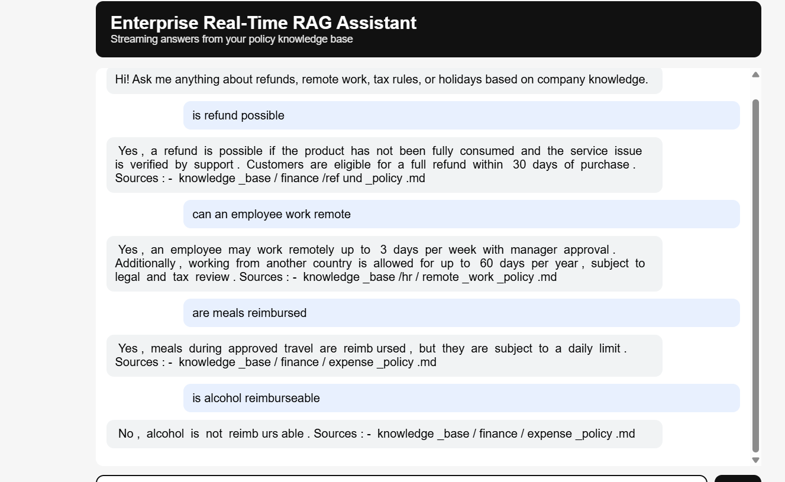

# Enterprise RAG-AI AGENT
A real-time enterprise AI agent that uses Retrieval-Augmented Generation (RAG) to answer policy and FAQ questions with OPEN-AI LLM from a centralized knowledge base, delivering grounded, citation-backed responses via a streaming chat interface.

## How the Sytem works (Simple flow)
1.	User asks a question in the chat
2.	Backend receives it
3.	Retriever searches the vector database
4.	Relevant chunks are returned
5.	Prompt builder prepares context for the LLM
6.	LLM generates the answer
7.	Answer is streamed to the frontend
8.	Sources are shown

### Output
Below is an example chat


## Run locally

### 1 Clone the repository
```bash
git clone https://github.com/devo002/Enterprise-RAG-AI-Agent.git
cd Enterprise-RAG-AI-Agent
```

### 2 Create venv & install
```bash
python -m venv .venv
# Windows
source venv/Scripts/activate
pip install -r requirements.txt
```

### 3 Set env vars 
Get your OPENAI_API_KEY create a .env file and save the key 


### 4 Start FastAPI
```bash
uvicorn backend.app:app --reload
```

### 5 Run the ingestion to create the chromadb
```bash
python backend/ingest.py
```

### 5 Open the web interface
Go to the frontend folder and open the index.html with liveserver and start the chat about anything.


## To run in production

### Create the Render service
Go to Render and connect to the github project. Select python as the runtime

Set Build command
```bash
pip install -r requirements.txt && python backend/ingest.py
```
Start command
```bash
uvicorn backend.app:app --host 0.0.0.0 --port $PORT
```
Enter the OPENAI_API_KEY and click deploy


### Import the frontpage on Vercel
Go to Vercel and import from github the repository. In rootdirectory select the frontend folder and click deploy...
Ensure to change the const API_URL in the index.html to the link provided by Render.
